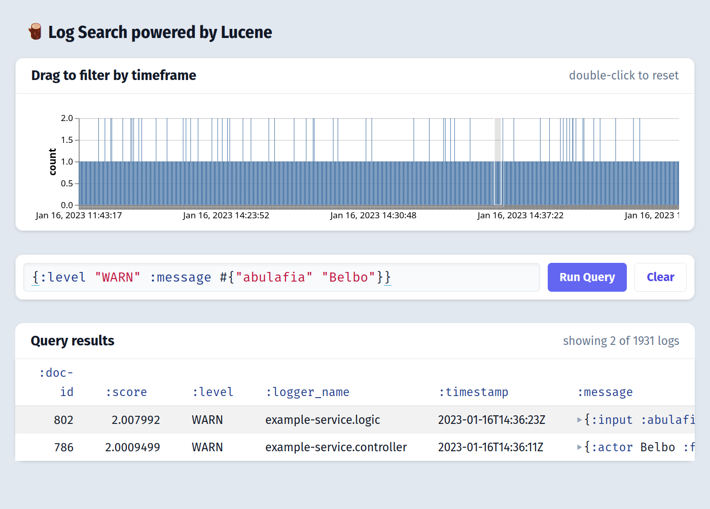

# lurk

A log dashboard tool powered by [Clerk](https://github.com/nextjournal/clerk) and [Lucene](https://lucene.apache.org/), via [lucene-clj](https://github.com/jaju/lucene-clj).



## 🚦 Status

A proof-of-concept ALPHA

## 👩‍🎨 Using Lurk

### startup

start a repl via something like
```bash
clj -Adev -Sdeps '{:deps {cider/cider-nrepl {:mvn/version "0.29.0"} }}' -m nrepl.cmdline --middleware "[cider.nrepl/cider-middleware]"
```

open [`src/nextjournal/lurk.clj`](https://github.com/nextjournal/lurk/blob/main/src/nextjournal/lurk.clj), run `(nextjournal.clerk/show!)`, and navigate to [http://localhost:6677/](http://localhost:6677/)

this will create an in-memory lucene index over the contents of [`example_service/json-logs/example-service.log`](https://github.com/nextjournal/lurk/blob/main/example_service/json-logs/example-service.log) and display a dashboard. Any new addtions to that `example-service.log` will get indexed and shown.

### generating example logs

In the `example_service` directory there is a simple service that loops forever and generates json-formatted logs. To start this process:

```bash
cd example_service
clj -Xrun
```

This begins writing json logs to `example_service/json-logs/example-service.log`


### log queries

Querying can be done using [lucene-clj query language](https://github.com/jaju/lucene-clj#search-variations)

```
{:level "WARN"}
```

or

```
{:level "WARN" :message #{"abulafia" "Belbo"}}
```
